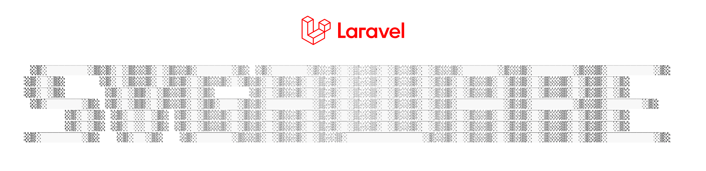

SVGAware simplifies SVG management in Laravel applications by eliminating duplicated markup and removing the need to edit complex SVG code directly.

It allows you to render SVGs through Blade components, directives, or a Facade — with full Tailwind CSS styling support.

## Install
Install via Composer:

```bash
composer require bypickering/laravel-svgaware
```

To publish the available config and add items to the purge list:
```bash
php artisan vendor:publish --tag=svgaware-config
```

## Getting Started
Place your .svg files inside:

```bash
${projectRoot}/resources/svg
```

You can change this location using the SVGAWARE_ROOT variable in your .env file.

## Usage
### Blade Component
SVGAware provides a Blade component:
```html
<x-svg src="icon-name" />
```

You do not need to include the .svg extension.
The extension is automatically appended using the `SVGAWARE_APPEND` configuration value.

### Blade Directive 
You can use the directive instead:

```php
@svg(icon-name)
```

### Facade
If you are not using Blade components, a `SvgAwareFacade` is also available.

```php
use Pickering\SVGAware\Facades\SvgAwareFacade;

$svgHTML = Svg::render('icon_name');
``` 

## Dynamic Tags
SVGAware allows you to define placeholder tags inside your SVG files. This allows you to pass arbitrary values into a specific location in the SVG document.

```html
<svg width="200" height="200" xmlns="http://www.w3.org/2000/svg">
    {tag_name_1}
    <circle cx="100" cy="100" r="50" fill="blue" />
    {tag_name_2}
</svg>
```

You may not include spaces when defining tags:

```php
✅: {tag_name} 
❌: { tag_name }
```

### Used In Blade Component
```html
<x-svg src="icon-name" tag_name="Some Value"/>
```
### Used In Directive
```php
@svg(icon-name, ['tag_name' => 'Some Value'])
```

### Used In Facade
```php
// With attributes and tags
$svgHTML = SvgAwareFacade::render('icon_name', [
    'class' => 'h-5 w-5 text-blue-500',
    'tag_name' => 'dynamic_value'
]);
```

## Attribute Forwarding
SVGAware will forward attributes and inject them into the root svg element allowing you the flexibility to add any attributes you need.

> Take note when naming your dynamic tags. If you pass a name that does not match a dynamic tag it will be injected as an attribute in the svg element.

```php
$svgHTML = SvgAwareFacade::render('icon_name', [
    'id' => "svg_id",
    'class' => 'h-5 w-5 text-blue-500',
    'fill' => "fill-blue-500",
    'stroke' => "stroke-green-500",
    'tag_name' => 'dynamic_value',
]);
```


## Purge Behavior
SVGAware automatically cleans SVG attributes to make them easier to style — especially when using Tailwind CSS.

By default, the following attributes are removed from the root `<svg>` element:
* width
* height
* fill

You can customize this list inside: `config/svgaware.php` by modifying the `purge_list` array.
## Root Directory
The root directory defines where SVGAware looks for SVG files.

By default, it is set to `${projectRoot}/resources/svg`, and you can change it using:
* .env → SVGAWARE_ROOT
* config/svgaware.php → root


## Configuration
### Environment Variables
| Name | Default | Description |
|------|----------|-------------|
| `SVGAWARE_ROOT` | `${projectRoot}/resources/svg` | Root directory where SVG files are stored. |
| `SVGAWARE_COMPONENT` | `svg` | Name of the Blade component used to render SVGs. |
| `SVGAWARE_DIRECTIVE` | `svg` | Name of the Blade directive used to render SVGs. |
| `SVGAWARE_APPEND` | `.svg` | String appended to SVG names when resolving files (e.g., `icon` → `icon.svg`). |
| `SVGAWARE_PREPEND` | `""` | String prepended to SVG names when resolving files. |
| `SVGAWARE_PURGE` | `true` | Determines whether SVG cleanup functionality runs automatically. |

### Config File
Located at: `config/svgaware.php` and maps all `.env` variables and defines the `purge_list`.

The `purge_list` is the list of attributes that will be deleted from the root `svg tag`.

```php
return [
    'root'       => env('SVGAWARE_ROOT', resource_path('svg')),
    'component'  => env('SVGAWARE_COMPONENT', 'svg'),
    'directive'  => env('SVGAWARE_DIRECTIVE', 'svg'),
    'append'     => env('SVGAWARE_APPEND', '.svg'),
    'prepend'    => env('SVGAWARE_PREPEND', ''),
    'purge'      => env('SVGAWARE_PURGE', true),
    'purge_list' => ['width', 'height', 'fill'],
];
```


## Requirements

SVGAware requires:
* PHP 8.1 or higher
* Laravel 10 or higher


## License
SVGAware is open-sourced software licensed under the MIT license.

© 2026 Pickering

Permission is hereby granted, free of charge, to any person obtaining a copy of this software and associated documentation files to deal in the Software without restriction, including without limitation the rights to use, copy, modify, merge, publish, distribute, sublicense, and/or sell copies of the Software.

See the LICENSE file for the full license text.